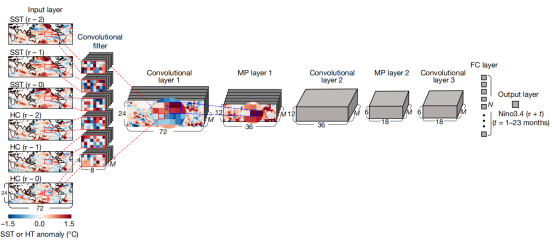
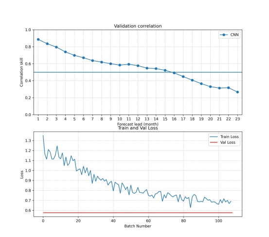

# ENSO-forecast-mindspore implementation
An unofficial implementation of paper "Deep learning for multi-year ENSO forecast".

Paper DOI: [10.1038/s41586-019-1559-7](https://doi.org/10.1038/s41586-019-1559-7) 



### Data preparation

We used data from three CMIP6 climate models, with variables tos (sea surface temperature) and zos (sea surface height), processed into a format suitable for this project. The processed data can be downloaded here: https://pan.baidu.com/s/1dSRlFzbxQntPCe1p2_kgYA?pwd=x7yy  Of course you can also download more data for training straightly from CMIP6 official website. Then you just need to modify the data path in `data.py`

### Train

Simply run:

```bash
python train.py --exp_name <your_exp_name> --pretrain --batch_size 500 --epochs 10
```

If you set `--pretrain`，you use the CMIP data and the OBSTrain data simultaneously for training, otherwise you use the CMIP data for training and OBSTrain data for fintuning, which will require you to run `finetune.py` after the training is completed.

### Result
After training of finetuning, you get the experiment results in `experiments/<your_exp_name>`, including the saved model `pretrained_model.ckpt` and the validation result `logfile.pickle` and the result figure `result_fig.png`.

